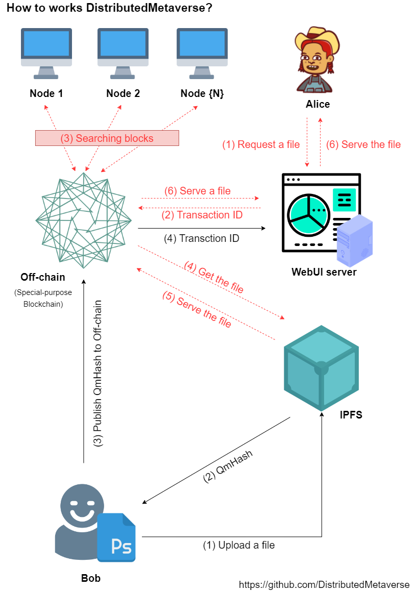

# DistributedMetaverse
2022 공개 SW 개발자대회 (탈중앙화를 활용하는 보안 분산 레포지토리 플랫폼 구현)

## Screenshot

See Demo: https://youtu.be/ch0By7mrloc

## Background & Purpose
- In general, **Bitcoin** or **Etherium** consists of On-Chain with transaction functions, but off-Chain with a set purpose of use was selected by focusing on the blockchain data structure without a coin system with transaction functions.
- The reason for choosing Off-Chain is that it usually uses Bitcoin or Ethereum to activate financial transaction functions, such as NFT. IPFS is widely used as a means of storing the original data, and IPFS refers to the hash (HASH) that users have as a basis for withdrawing files. If you lose the hash, you can't find the file forever.
- To use on-chain to prevent the loss of hash, the transaction function supported by on-chain is likely to cause waste in management personnel and capabilities.
- This team has prepared a system that is perfect as an industrial blockchain through blockchain tailored to this limited purpose.

## Environment
- **blockchain** is Echo v4 https://github.com/DistributedMetaverse/distributed-metaverse-offchain
- **front** is React v18.2.x, TypeScript v18.0.x
- **back** is NestJS v9.0.x, 10.6.4-MariaDB

## System Configuration & Architecture

## Key features of the project
1. Distributed storage of hash values implemented as Off-Chain (special purpose blockchain)
	- When withdrawing FILE from IPFS, Hash is used, so Hash is not lost through distributed storage
2. Blocks are generated through proof of work (PoW). Blocks created are stored locally and on both connected networks, ensuring integrity through distribution
3. Realize decentralized hard storage

## Expected effects and application fields
1. Compared to NFT, which is based on blockchain with strong financial transaction characteristics, it performs only special purposes under limited authority, minimizing unnecessary waste of technical personnel.
2. Companies that require data integrity are solving the problem through expensive RAID configurations, but IPFS, which shares storage resources distributed around the world, and a special purpose blockchain (implemented by off-chain) that distributes hash can provide stronger integrity than RAID.

## Contact us
- qudwn0768@naver.com
- gnh1201@gmail.com
